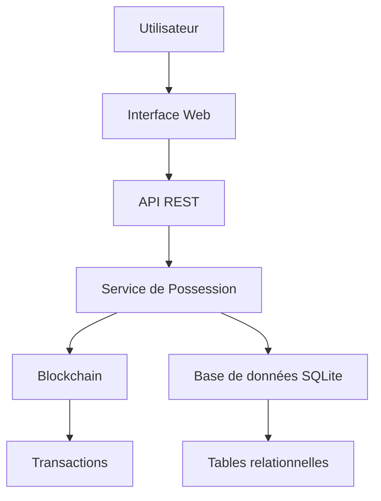
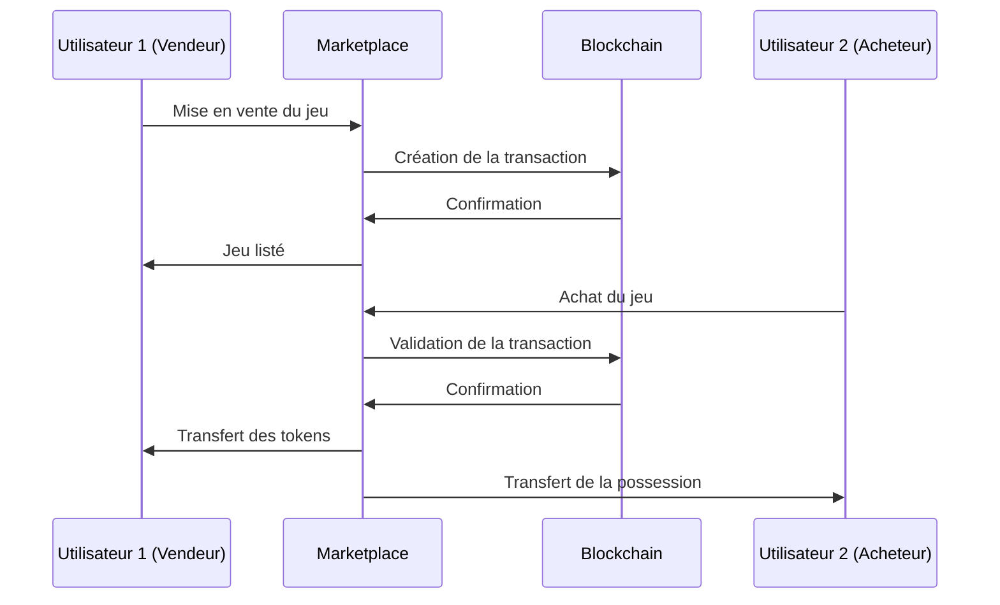

# 🎮 Cahier des Charges - Système de Marketplace Blockchain
## MiniGames Store - Plateforme de Jeux avec Économie Virtuelle et Revente

---

## 📋 Table des Matières

1. [Vue d'ensemble du projet](#vue-densemble-du-projet)
2. [Architecture technique](#architecture-technique)
3. [Système de blockchain](#système-de-blockchain)
4. [Système de marketplace et revente](#système-de-marketplace-et-revente)
5. [Fonctionnalités utilisateur](#fonctionnalités-utilisateur)
6. [Modèle économique](#modèle-économique)
7. [Sécurité et intégrité](#sécurité-et-intégrité)
8. [Interface utilisateur](#interface-utilisateur)
9. [Déploiement et maintenance](#déploiement-et-maintenance)
10. [Roadmap et évolutions](#roadmap-et-évolutions)

---

## 🎯 Vue d'ensemble du projet

### Objectif principal
Créer une plateforme de jeux innovante intégrant un système de marketplace décentralisé basé sur la blockchain, permettant aux utilisateurs d'acheter, posséder et revendre des jeux de manière sécurisée et transparente.

### Valeur ajoutée unique
- **Première plateforme de jeux avec système de revente blockchain intégré**
- **Économie virtuelle basée sur de la fausse monnaie**
- **Propriété numérique vérifiable (NFT-like)**
- **Transparence totale des transactions**
- **Commissions optimisées pour la revente**

### Public cible
- Joueurs passionnés de mini-jeux
- Collectionneurs de jeux numériques
- Utilisateurs intéressés par les technologies blockchain
- Développeurs de jeux indépendants

---

## 🏗️ Architecture technique

### Stack technologique

#### Backend
- **Node.js** - Runtime JavaScript
- **Express.js** - Framework web
- **SQLite** - Base de données relationnelle
- **Crypto** - Cryptographie native Node.js

#### Frontend
- **EJS** - Moteur de templates
- **CSS3** - Styling responsive
- **JavaScript ES6+** - Logique côté client
- **Fetch API** - Communication asynchrone

#### Blockchain
- **Blockchain personnalisée** - Implémentation native
- **SHA-256** - Algorithme de hachage
- **Proof of Work** - Mécanisme de consensus
- **Transactions cryptographiques** - Intégrité des données

### Architecture des données

---

## ⛓️ Système de blockchain

### Caractéristiques principales

#### 1. Structure des blocs
- **Timestamp** - Horodatage de création
- **Transactions** - Liste des transactions
- **Previous Hash** - Référence au bloc précédent
- **Nonce** - Valeur pour le minage
- **Hash** - Empreinte cryptographique

#### 2. Algorithme de consensus
- **Proof of Work** avec difficulté ajustable
- **Mining reward** de 100 tokens par bloc
- **Validation automatique** des transactions
- **Intégrité de la chaîne** vérifiée en continu

#### 3. Types de transactions
- `game_purchase` - Achat depuis le store officiel
- `game_sale` - Vente entre utilisateurs
- `transfer` - Transfert de tokens
- `commission` - Paiement des commissions
- `mining_reward` - Récompense de minage

### Avantages techniques
- **Immutabilité** - Aucune transaction ne peut être modifiée
- **Transparence** - Toutes les transactions sont publiques
- **Décentralisation** - Pas de point de défaillance unique
- **Traçabilité** - Historique complet des possessions

---

## 🛒 Système de marketplace et revente

### Fonctionnalités principales

#### 1. Store officiel
- **Catalogue de jeux** - Jeux disponibles à l'achat
- **Prix fixes** - Tarification officielle
- **Commissions élevées** - 10% plateforme + 5% développeur
- **Tokens de possession** - Génération automatique

#### 2. Marché d'occasion
- **Listings utilisateurs** - Jeux mis en vente par les joueurs
- **Prix libres** - Fixation libre des prix
- **Commissions réduites** - 5% plateforme + 2% développeur
- **Filtres avancés** - Genre, prix, disponibilité

#### 3. Gestion des possessions
- **Tokens uniques** - Chaque jeu possède un token unique
- **Statuts multiples** - owned, listed_for_sale, sold
- **Historique complet** - Traçabilité des propriétaires
- **Revente illimitée** - Possibilité de revendre indéfiniment

### Workflow de transaction

---

## 👤 Fonctionnalités utilisateur

### Interface principale

#### 1. Onglets de navigation
- **Store Officiel** - Achat de nouveaux jeux
- **Marché d'Occasion** - Achat de jeux d'occasion
- **Mes Jeux** - Gestion de la bibliothèque personnelle
- **Historique** - Suivi des transactions

#### 2. Système de filtres
- **Filtre par genre** - Action, Stratégie, Puzzle
- **Filtre par prix** - Slider de prix maximum
- **Recherche textuelle** - Nom du jeu
- **Tri dynamique** - Prix, date, popularité

#### 3. Modales interactives
- **Modal d'achat** - Confirmation d'achat
- **Modal de vente** - Configuration du prix
- **Calcul automatique** - Commissions en temps réel
- **Validation** - Vérification des fonds

### Gestion des tokens

#### 1. Économie virtuelle
- **Tokens de départ** - 1000 tokens gratuits
- **Système de portefeuille** - Gestion des fonds
- **Adresses uniques** - wallet_address par utilisateur
- **Historique des soldes** - Suivi des variations

#### 2. Transactions sécurisées
- **Vérification des fonds** - Avant chaque achat
- **Transferts atomiques** - Tout ou rien
- **Rollback automatique** - En cas d'erreur
- **Notifications** - Confirmation des opérations

---

## 💰 Modèle économique

### Structure des commissions

#### Achat officiel
- **Plateforme** : 10% du prix d'achat
- **Développeur** : 5% du prix d'achat
- **Total** : 15% de commission

#### Revente d'occasion
- **Plateforme** : 5% du prix de vente
- **Développeur** : 2% du prix de vente
- **Total** : 7% de commission

### Avantages du modèle
- **Incentive à la revente** - Commissions réduites
- **Rémunération équitable** - Développeurs toujours rémunérés
- **Viabilité économique** - Plateforme rentable
- **Croissance durable** - Économie circulaire

---

## 🔒 Sécurité et intégrité

### Mesures de sécurité

#### 1. Cryptographie
- **SHA-256** - Hachage sécurisé
- **Tokens uniques** - Génération cryptographique
- **Signatures numériques** - Validation des transactions
- **Chiffrement des données** - Protection des informations sensibles

#### 2. Validation des transactions
- **Vérification des fonds** - Solvabilité de l'acheteur
- **Validation des possessions** - Propriété légitime
- **Contrôle d'intégrité** - Cohérence des données
- **Protection contre la double dépense** - Prévention des fraudes

#### 3. Gestion des erreurs
- **Transactions atomiques** - Tout ou rien
- **Rollback automatique** - Annulation en cas d'erreur
- **Logs détaillés** - Traçabilité des opérations
- **Alertes système** - Détection des anomalies

### Audit et transparence
- **Blockchain publique** - Toutes les transactions visibles
- **Historique immuable** - Aucune modification possible
- **Vérification indépendante** - Validation par les pairs
- **Rapports détaillés** - Statistiques complètes

---

## 🎨 Interface utilisateur

### Design et expérience

#### 1. Interface moderne
- **Design responsive** - Adaptation mobile/desktop
- **Thème cohérent** - Identité visuelle unifiée
- **Navigation intuitive** - Parcours utilisateur optimisé
- **Feedback visuel** - Confirmations et états

#### 2. Composants interactifs
- **Cartes de jeux** - Présentation attractive
- **Modales dynamiques** - Interactions fluides
- **Filtres en temps réel** - Recherche instantanée
- **Animations subtiles** - Expérience engageante

#### 3. Accessibilité
- **Contraste élevé** - Lisibilité optimale
- **Navigation clavier** - Accessibilité complète
- **Messages d'erreur clairs** - Compréhension facile
- **Chargement progressif** - Performance optimisée

### États et interactions

#### 1. États des jeux
- **Disponible** - En vente officielle
- **Possédé** - Dans la bibliothèque utilisateur
- **En vente** - Listé sur le marketplace
- **Vendu** - Transaction terminée

#### 2. Actions possibles
- **Acheter** - Depuis le store ou le marketplace
- **Vendre** - Mettre en vente
- **Annuler** - Retirer de la vente
- **Consulter** - Voir les détails

---

### Impact attendu
Ce système de marketplace blockchain représente une **révolution dans l'industrie du gaming**, offrant aux joueurs une **vraie propriété** de leurs jeux et la possibilité de **monétiser** leur bibliothèque. La technologie blockchain garantit **transparence** et **sécurité**, tandis que l'économie virtuelle crée un **écosystème durable** et **profitable** pour tous les acteurs.

---

*Document créé pour la présentation aux portes ouvertes - MiniGames Store 2024*
